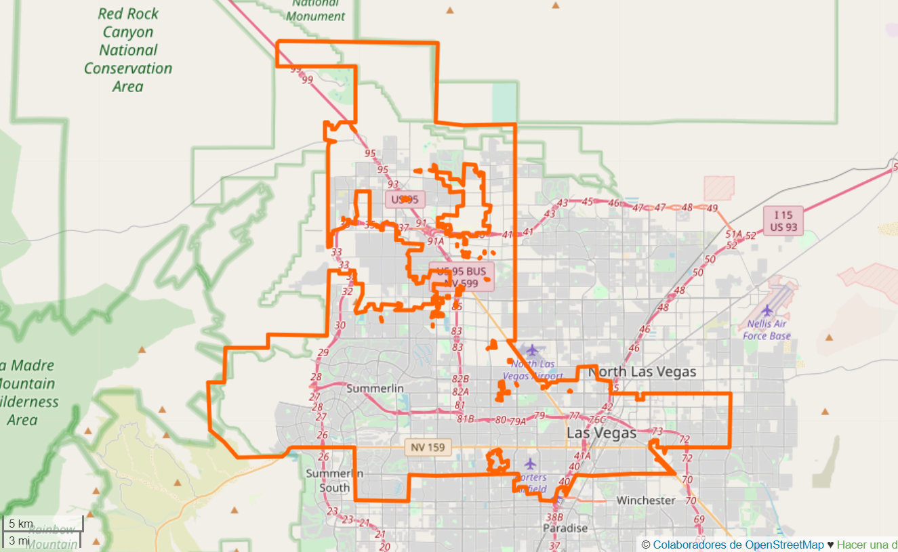

# OpenStreetMap Data Project
### Map Area
Las Vegas, Nevada, United States



According to Wikipedia, [Las Vegas](https://en.wikipedia.org/wiki/Las_Vegas) is *"the 28th-most populated city in the United States, the most populated city in the state of Nevada, and the county seat of Clark County. The city anchors the Las Vegas Valley metropolitan area and is the largest city within the greater Mojave Desert".*


* [openstreetmap.org](https://www.openstreetmap.org/relation/170117)

Las Vegas is my next holidays destination and that's the ultimate reason I chose this map for the project. Beyond this fact I'm interested in working with this data to further explore street naming

The downloaded data was provided directly by OpenStreetMap, since Mapzen site is shutting down its systems. Above I provided OpenStreetMap link in case you wanted to run the code with the original dataset.


## Project Outline
The project consists of three distinct parts:

* **Data Audit:** carried out by the `tags.py`, this section is intended to make sense of the data as a whole and assess its quality. This routine will programmatically check for data validity, accuracy and other measures seen throughout the course materials.
* **Export and fix:** `audit.py` will reveal problems with the map data and provide the necessary information to create a data cleaning plan to execute on. Bear in mind that `audit.py` won't perform any modification on the data itself, but rather print on the terminal the problems that it has encountered. After this first audition, and unlike `audit.py`, it'll be `data.py` job to export the data according to a predetermined schema, but also programmatically fix the semantic mistakes it finds along the way.
* **Visualizing the data:** once audited and fixed, this last section will consist on revealing the most interesting insights of the data.


## Part I: Data Audit
In this part the data will be mapped out and visualized, programmatically checking for possible quality flaws. At the end of the day the data should be ready to fit a structure that will look like the schema found at `schema.py`.

The audit process will be mainly concerned by two data points: nodes and ways. Each element also contains relevant information within, that will be kept and translated to aforementioned data structure.

Regardless the sample file reveals most fields are self descriptive, they will be further analyzed one by one to understand the data behind them and watch out for quality issues.

### Auditing nodes
The node element can be found across the data file under the `<node></node>` tag, here's a sample:

```
    <node changeset="39246680" id="137189699" lat="36.083543" lon="-115.0489665" timestamp="2016-05-11T16:35:08Z" uid="2655992" user="steverumizen" version="4">
        <tag k="highway" v="traffic_signals" />
        <tag k="traffic_signals" v="signal" />
    </node>
```

According to the `schema.py`, nodes will be mapped to the following schema:

**Node Element Structure**

* node: dictionary
  * id
  * user
  * uid
  * version
  * lat
  * lon
  * timestamp
  * changeset
  * node_tags: list of dictionaries
    * id
    * key
    * value
    * type

The auditing will be performed in the `audit.py` file.

### Auditing ways
After the audit of the nodes, checking for ways is rather easy since both data structures share most of the elements and schema.

Regardless, the function `audit_ways()`, which is a carbon copy of its brother `audit_nodes()` and rely on the same helper functions, goes through the same process seen in Auditing Nodes.

The way element can be found across the data file under the `<way></way>` tag and its structure differs a little bit from the node, here’s a sample:

```
<way changeset="26355116" id="14281932" timestamp="2014-10-27T03:36:26Z" uid="3392" user="SimMoonXP" version="12">
    <nd ref="137571609" />
    <nd ref="137571606" />
    <nd ref="137571603" />
    <nd ref="137571600" />
    <nd ref="137571598" />
    <tag k="name" v="Airport Connector" />
    <tag k="FIXME" v="verfiy bicycle=yes" />
    <tag k="lanes" v="3" />
    <tag k="layer" v="-1" />
    <tag k="oneway" v="yes" />
    <tag k="tunnel" v="yes" />
    <tag k="bicycle" v="yes" />
    <tag k="highway" v="motorway" />
</way>
```

According to the `schema.py`, ways will be mapped to the following schema:

    **Way Element Structure**

    * way: dictionary
      * id
      * user
      * uid
      * version
      * timestamp
      * changeset
      * way_nodes: list of dictionaries
        * id
        * node_id
        * position
      * way_tags: list of dictionaries
        * id
        * key
        * value
        * type

### Other checks
#### Tags:
Parsing through the Las Vegas dataset with "ElementTree" and count the unique element by using count_tags function I got the number of tags as follows:
```
{'bounds': 1,
 'member': 4657,
 'nd': 1367246,
 'node': 1153019,
 'osm': 1,
 'relation': 573,
 'tag': 512985,
 'way': 125179}
```

Parsing through the Las Vegas sample dataset with "ElementTree" and count the unique element by using count_tags function I got the number of tags as follows:
```
{'member': 815,
 'nd': 274423,
 'node': 230604,
 'osm': 1,
 'relation': 115,
 'tag': 103219,
 'way': 25036}
```

#### Tag Patterns:
Checking ‘k’ value for each tag. There are three regular expression, lower is for tags that contain only lowercase letters and are valid. lower_colon is for other valid tags with a colon in the value. problem is for tags with problematic characters. The results are as below:
```
{'lower': 67955, 
'lower_colon': 33821, 
'other': 1443, 
'problem': 0}
```


## Part II: Export and fix
Problems in the DATA
    After programatic check performed by `audit.py` in the Las Vegas area sample size map, I met one main problem with the data:
* Format disparity, case inconsistency, grammar mistakes and over­abbreviation for street types on second level tags `addr:street` (for the correct form *Street* there is: *St, street, St., S*)

To correct the abbreviated street names following code was implemented, this code finds and corrects the abbrvaited street names. 
Functions used:
* audit_street_type: Checks if the street name is in the expected list.
* street_name: Check whether the attribute k = “addr:street”. 
* audit: Returns a list which match the previous two function conditions. 
* update_name: Updates the old street name with a new one.
* audit_postal_code: Checks if the postal code is in the "Las Vegas" zipcode list.

This update is done by the code in the `audit.py` file.

### Street types: format problems
The data contained several format problems, like over­abbreviation, typos and incorrect naming.

First the data was screened with regular expressions and data type validation through `audit()`. Once there was a clear view of the problems the data presented, they got fixed through `update_name()` function, called via the `shape_element()` function found in `data.py`.


## Part III: Visualizing the Data
This section contains basic statistics and insights of the dataset, the queries used to gather them, and some additional ideas.

### File sizes
```
las-vegas.osm .....................249 MB
las-vegas_sample.osm .............50.4 MB
nodes.csv ........................19.6 MB
nodes_tags.csv ....................507 KB
ways.csv .........................1.53 MB
ways_tags.csv ....................3.19 MB
ways_nodes.cv ....................6.91 MB
```

### Number of nodes
`sqlite> SELECT COUNT(*) FROM nodes;`

230604

### Number of ways
`sqlite> SELECT COUNT(*) FROM ways;`

25036

### Number of unique users
```
sqlite>
SELECT COUNT(DISTINCT(u.uid))
FROM (SELECT uid FROM node UNION ALL
SELECT uid FROM way) as u;
```

847

### Top contributing user
```
sqlite>
SELECT e.user, COUNT(*) as num
FROM (SELECT user FROM nodes UNION ALL SELECT user FROM ways) e
GROUP BY e.user
ORDER BY num DESC
LIMIT 1'
```

Top contributor of the dataset:

```
alimamo                 50035
```


## In-depth Analysis
### Most important religion
```
sqlite>
SELECT nodes_tags.value, COUNT(*) as num FROM nodes_tags 
JOIN (SELECT DISTINCT(id) FROM nodes_tags WHERE value="place_of_worship") i 
ON nodes_tags.id=i.id 
WHERE nodes_tags.key="religion" 
GROUP BY nodes_tags.value 
ORDER BY num DESC
LIMIT 1';
```

Top religion of the dataset:

```
christian                 53
```

### And finally, top popular amenity
```
sqlite>
SELECT value, COUNT(*) as num
FROM nodes_tags
WHERE key="amenity"
GROUP BY value
ORDER BY num DESC
LIMIT 1';
```

Top amenity of the dataset:

```
restaurant                 101
```


## Conclusion
By far the most challenging — and also annoying, problem I have encountered wrangling the data has been the validity and consistency of each data point.

The fact users are contributing on each piece of data, makes it virtually impossible to ensure data quality across the board. For example, this is a chunk of a query displaying cities in the metro area:


## Suggestion
My suggestion would be to implement a pre-validation data entry. It won't definitely fix 100% of the problems, but at least it would avoid some errors, and these simple measures would account for a much cleaner dataset:

* Data type: if a value has to be an integer, blocks all the other possibilities.
* Range: if it is known that a value has to be within a predetermined range, flag the ones outside. 
* Autocompletion": if there are 3.000 entries under the key "Las Vegas", when a user wants to upload a new one, once a "b" is typed, show a dropdown with the most possible outcomes.
